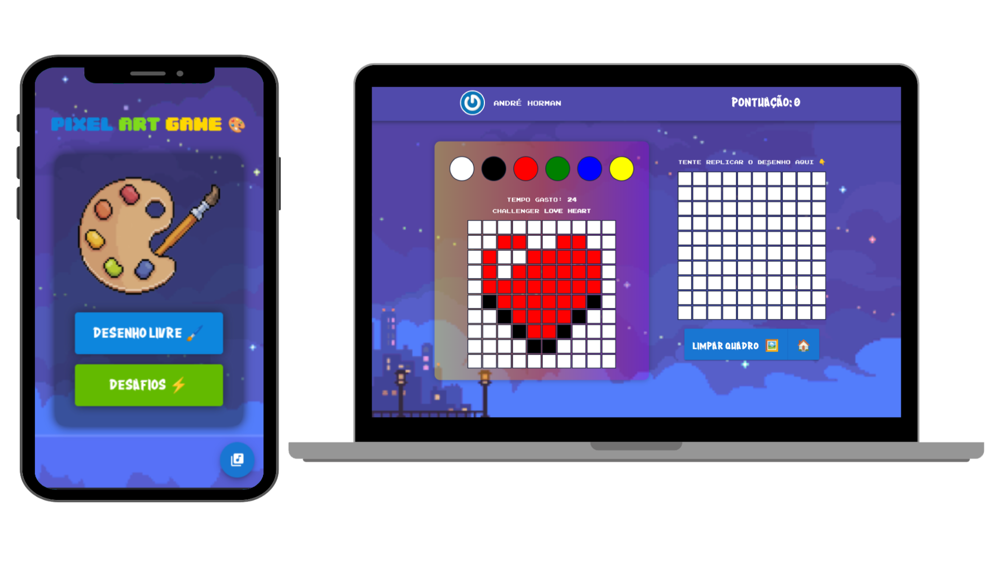

<h1 align="center">
  
PIXEL ART GAME 🎨

  
React JS ⚛️ | Redux Toolkit 🧰 | Styled Components 💅 | Material UI 🎩

</h1>

  <a href="#bookmark-sobre">Sobre</a>&nbsp;&nbsp;&nbsp;|&nbsp;&nbsp;&nbsp;
  <a href="#computer-rotas-da-aplicação">Rotas do App</a>&nbsp;&nbsp;&nbsp;|&nbsp;&nbsp;&nbsp;
  <a href="#rocket-tecnologias">Tecnologias</a>&nbsp;&nbsp;&nbsp;|&nbsp;&nbsp;&nbsp;
  <a href="https://pixel-art-game-andre-horman.vercel.app/" target="_blank">Aplicação na Vercel</a>

  

## :bookmark: Sobre

O **Pixel Art Game**  é um jogo desenvolvido para plataformas Desktop e Mobile que proporciona aos jogadores a experiência única de criar pinturas em estilo de 8 ou 16 bits. Agora, você pode elevar o desafio ao pintar quadros pixelados o mais rápido possível, com base em pinturas de referência, visando conquistar mais pontos. Sua pontuação será exibida na tela de classificação, incentivando a competição e o aprimoramento constante.

## :computer: Rotas da aplicação
 - Tela de Login ✅
 - Tela de Menu ✅
 - Tela de Desenho Livre ✅
 - Tela de Desafios ✅
 - Tela de Ranking ✅

## :rocket: Tecnologias

  - `React JS`
  > Biblioteca JavaScript para construção de interfaces de usuário interativas e reativas em aplicações web.
  - `Redux Toolkit`
  > Toolkit é um conjunto de utilidades oficial do Redux para desenvolvimento mais eficiente de aplicações com gerenciamento de estado.
  - `Styled Components`
  > Biblioteca que permite escrever estilos CSS diretamente em componentes React.
  - `Material UI`
  > Biblioteca de componentes de interface de usuário para React, seguindo as diretrizes de design da Google.
  - `Vercel`
  > Plataforma de hospedagem voltada para aplicações web modernas e escaláveis.

---
